## Screenshots

Here are some screenshots of the app:

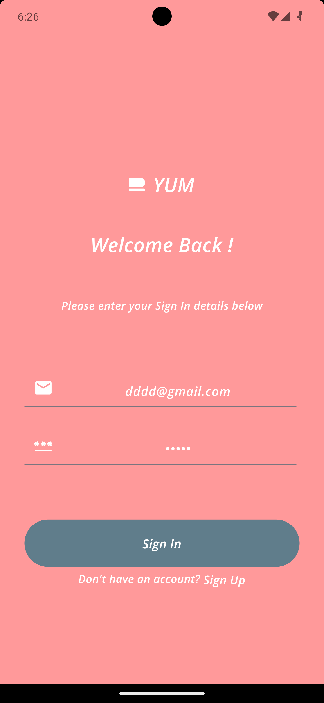</>

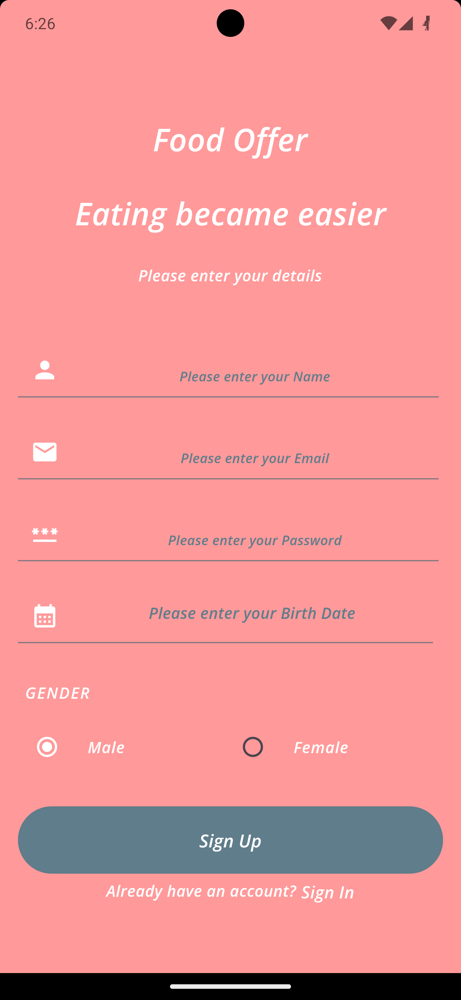

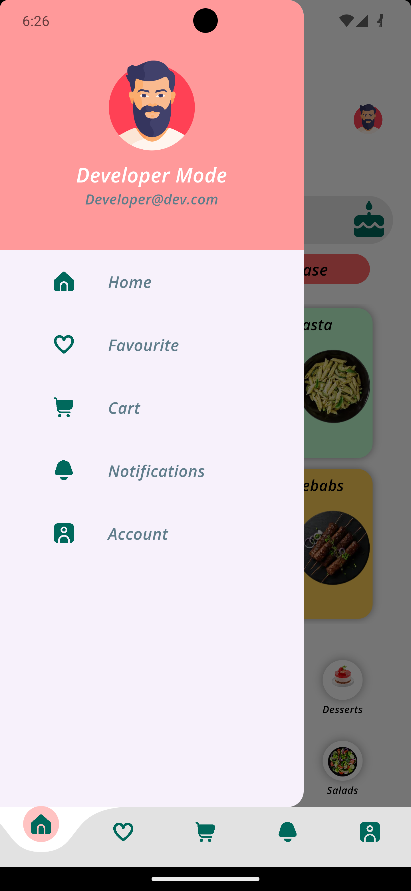

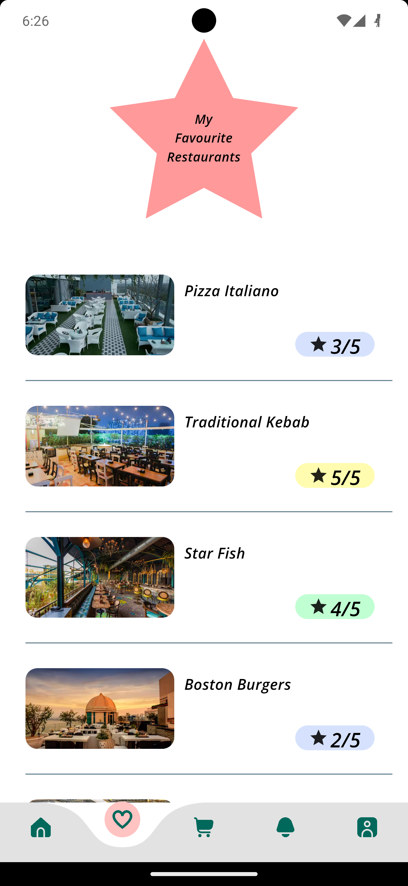

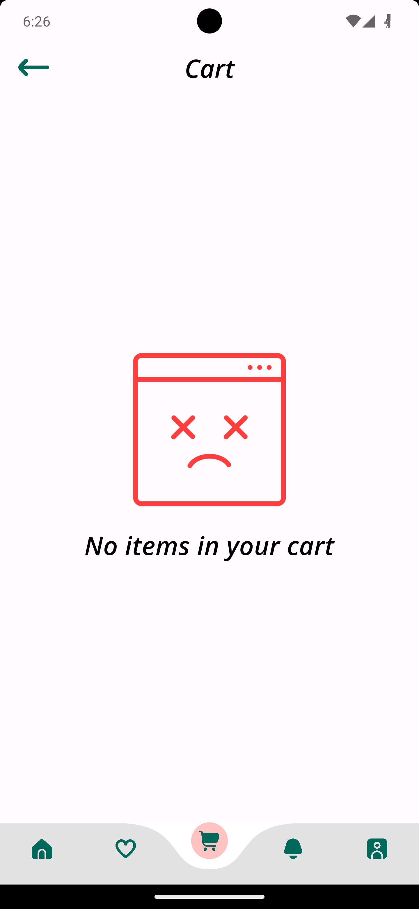

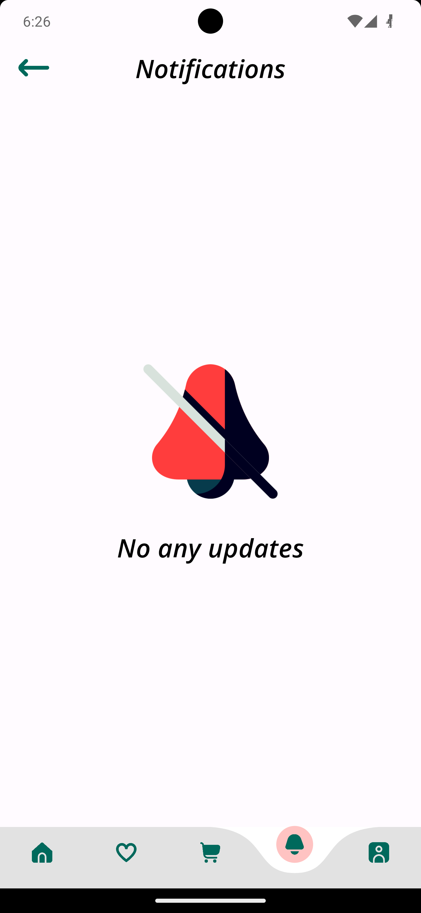

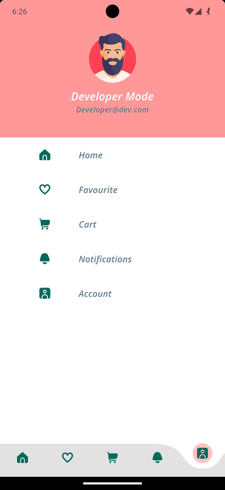

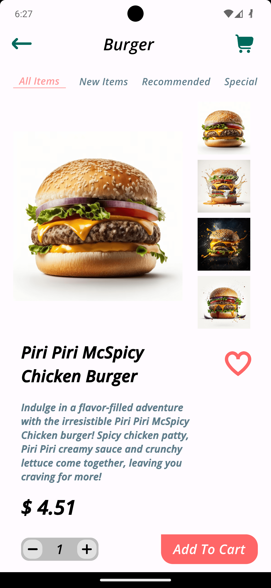

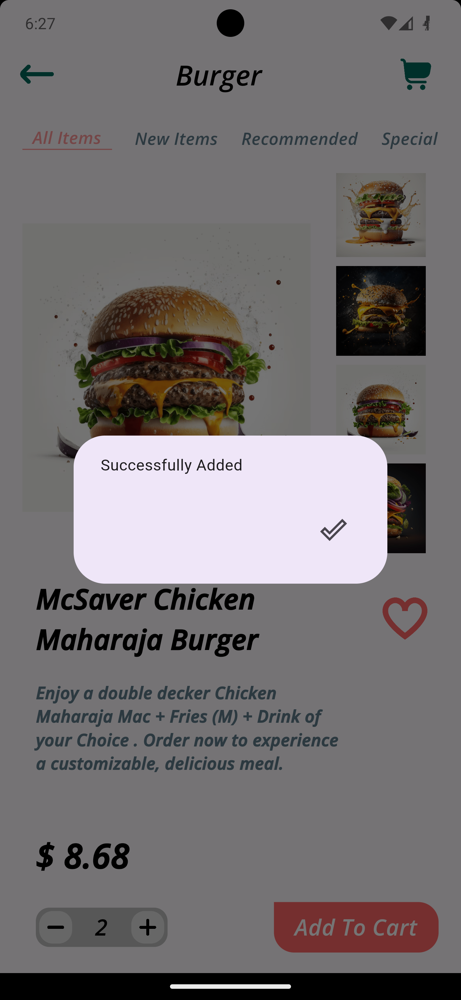

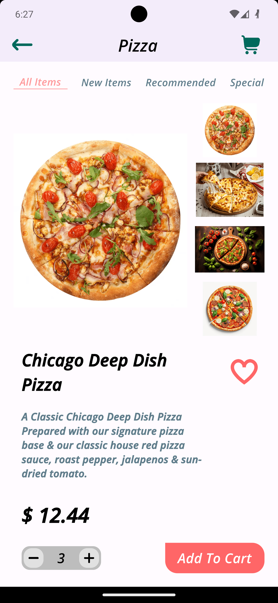

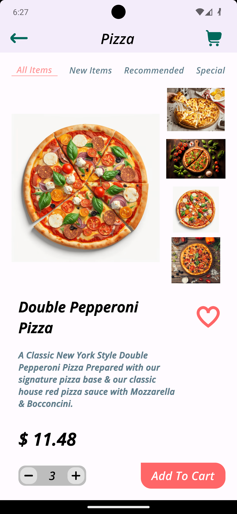

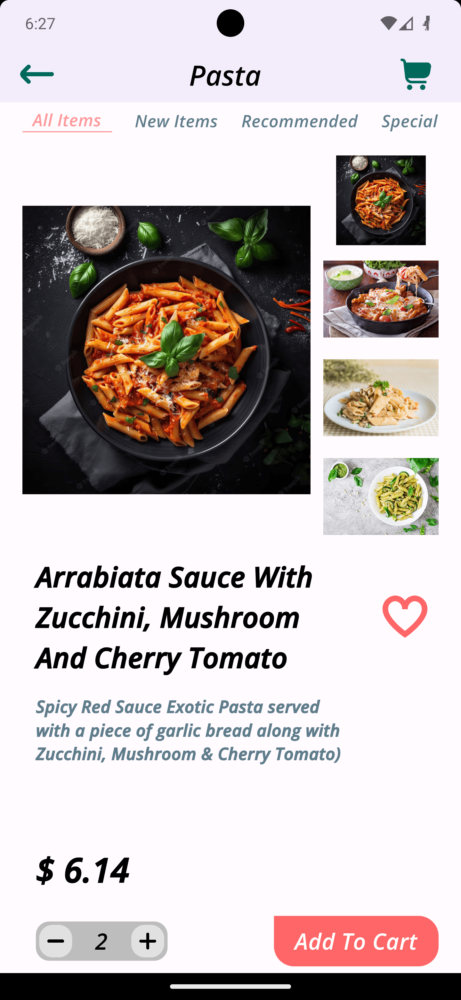

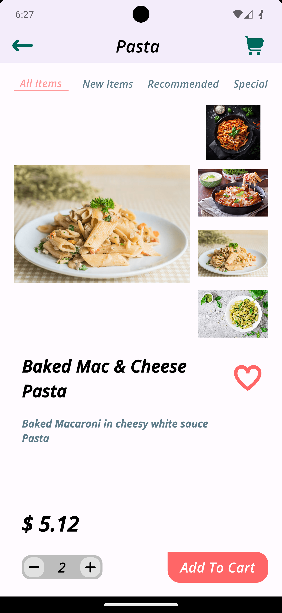

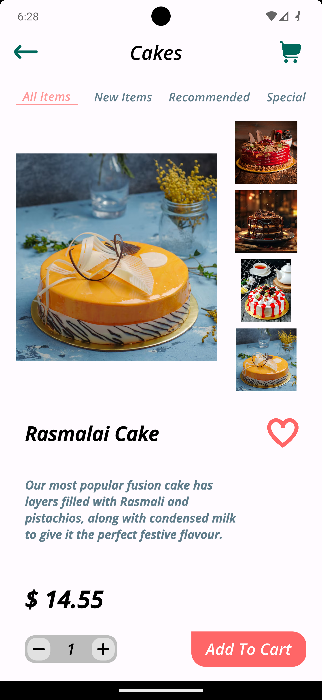

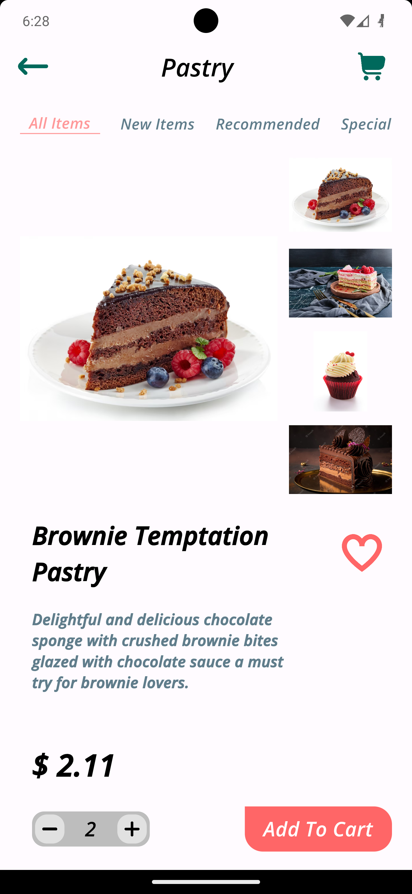

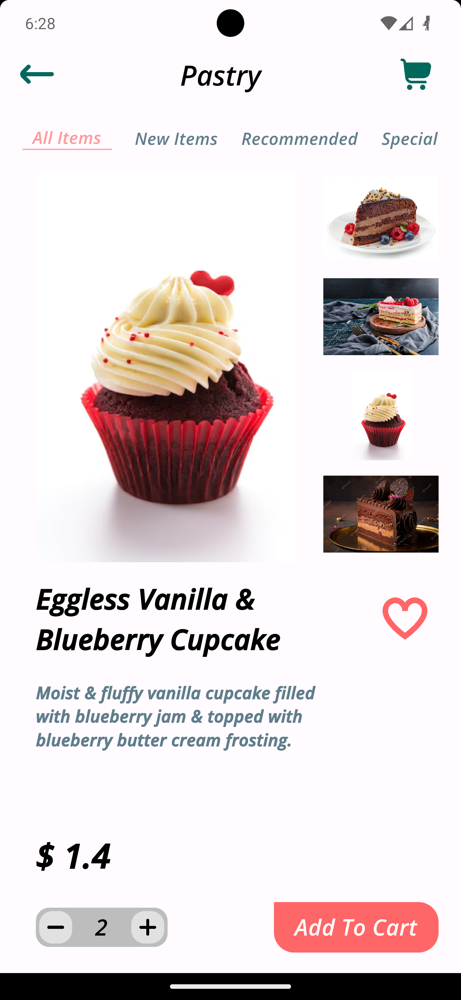

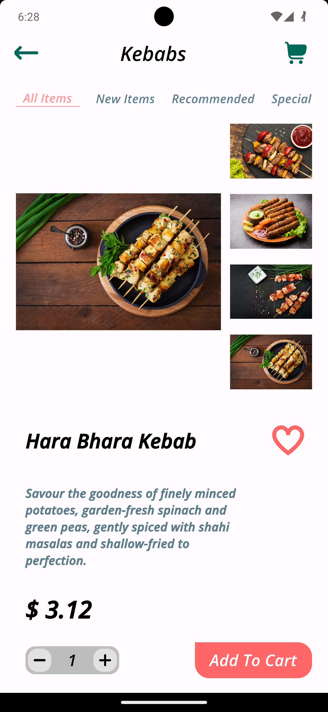

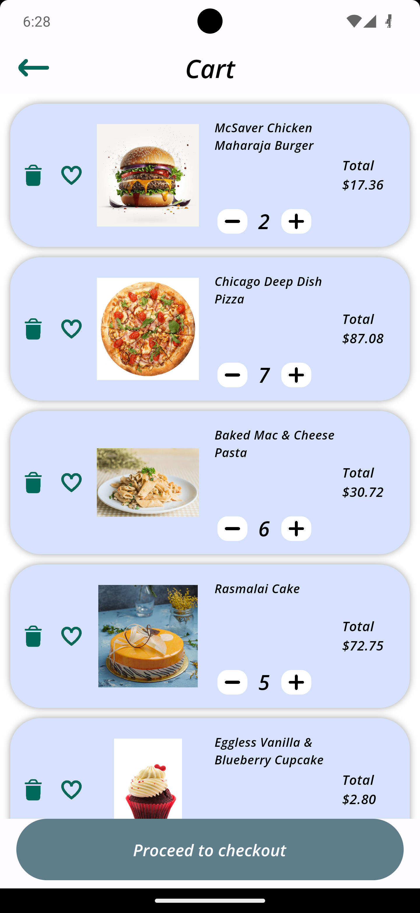

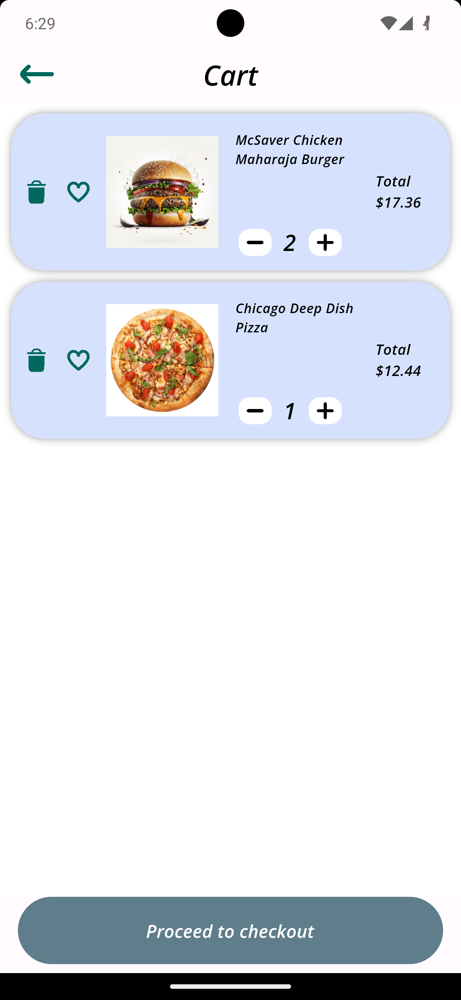

Please note that these screenshots are for demonstration purposes only and may not reflect the actual appearance of the app.

## Intro
The app is divided into three main screens:
* The home screen, which allows users to browse restaurants by category or location
* The restaurant screen, which shows the menu for a particular restaurant
* The order screen, which allows users to order food and drinks
  To order food, users first need to select a restaurant. They can do this by browsing the list of restaurants on the home screen or by searching for a specific restaurant.
  Once they have selected a restaurant, they can view the menu. The menu is divided into different categories, such as appetizers, entrees, and desserts.
  Users can add items to their order by tapping on the "+" button. They can also remove items from their order by tapping on the "-" button.
  When they are finished adding items to their order, users can tap on the "Order" button. This will take them to the order screen.
  On the order screen, users can review their order and enter their payment information. They can also choose a delivery method.
  Once they have entered their payment information and selected a delivery method, users can tap on the "Place Order" button. This will place their order and they will receive a confirmation email.

## Disclaimer

This project is for educational purposes only and should not be used for any commercial purposes.

## Support

If you need any help, please feel free to open an issue on the GitHub repository.

</s## Credits

This project was created by [Shahnawaz Khan](https://github.com/Shahnawazk7944).

## License

This project is licensed under the MIT license. Please see the [LICENSE](LICENSE) file for more information.

## Contributing

We welcome contributions to this project. If you would like to contribute, please fork the repository and submit a pull request.
